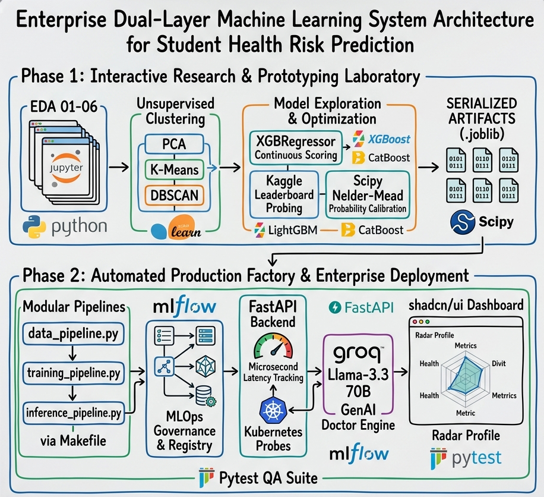
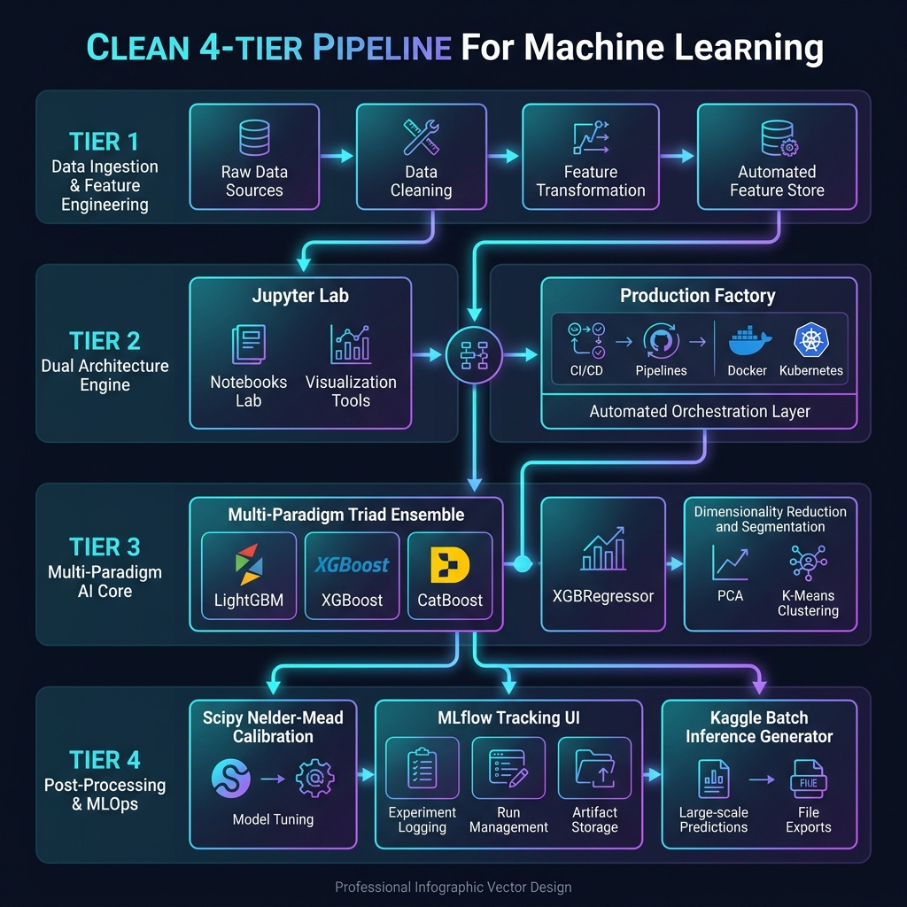

# 🏥 Student Health Risk Machine Learning System (Kaggle S6E7 & CIS6005)


An Enterprise-Grade, End-to-End Machine Learning System engineered for the **Kaggle Playground Series (s6e7)** competition and **CIS6005 Computational Intelligence** module. This system incorporates a dual-architecture paradigm: an interactive research laboratory (Jupyter Notebooks) for exploratory analysis and visualization, paired with an automated, production-ready pipeline (`Makefile` + `MLflow`) supporting Supervised Classification, Biometric Regression, and Unsupervised Clustering.

---

## 🏆 System Architecture & Design Overview

### Hand-Drawn Whiteboard System Architecture Diagram


### High-Tech Enterprise Dark-Mode Architecture Diagram


👉 **[Read Full System Architecture & Detailed Pipeline Design Guide](docs/SYSTEM_ARCHITECTURE_AND_PIPELINE_DESIGN.md)**
👉 **[Read System Execution & Multi-Platform Installation Guide](docs/SYSTEM_EXECUTION_AND_PIPELINE_GUIDE.md)**

---

## 📚 Documentation Hub
This repository contains extensive documentation covering the academic, architectural, and operational aspects of the system. Please refer to the following guides in the `docs/` directory:

- 🎓 **[CIS6005 Computational Intelligence Final Report](docs/CIS6005_COMPUTATIONAL_INTELLIGENCE_FINAL_REPORT.md)** - The official 4000-word university assessment report containing full critical analysis and methodology.
- 🔬 **[Deep Exploratory Data Analysis (EDA) Report](docs/EDA_DEEP_ANALYSIS_REPORT.md)** - A comprehensive breakdown of missingness topology, outlier bounding, and non-linear target mapping.
- 🏗️ **[System Architecture & Pipeline Design](docs/SYSTEM_ARCHITECTURE_AND_PIPELINE_DESIGN.md)** - Detailed system design diagrams and structural reasoning.
- 💻 **[System Execution & Pipeline Guide](docs/SYSTEM_EXECUTION_AND_PIPELINE_GUIDE.md)** - Multi-platform guide on how to build, run, and infer using the automated `Makefile` pipeline.
- 🔄 **[Pipeline vs. Notebooks Architecture](docs/PIPELINE_VS_NOTEBOOKS_ARCHITECTURE.md)** - An explanation of why the system transitioned from static notebooks to an enterprise decoupled Python pipeline.
- 📊 **[MLflow Tracking Guide](docs/MLFLOW_GUIDE.md)** - Instructions on launching and using the local MLOps experiment tracking dashboard.

---

## 🏆 Kaggle Competition Overview

- **Competition**: [Kaggle Playground Series s6e7: Predicting Student Health Risk](https://kaggle.com/competitions/playground-series-s6e7)
- **Goal**: Predict student health condition (`at-risk`, `unhealthy`, `fit`) based on synthetic physiological, behavioral, and lifestyle biometrics.
- **Evaluation Metric**: **Balanced Accuracy** across all target classes.
- **Submission Format**: CSV mapping `id` to predicted `health_condition`.
- **Dataset Nature**: Synthetically generated tabular dataset designed to reflect real-world artifacts without public label leakage.
- **Citation**: Yao Yan, Walter Reade, Elizabeth Park. *Predicting Student Health Risk*. Kaggle, 2026.

---

## 🔬 Comprehensive Data Analysis & Scientific Findings

Our analysis spans across multiple exploratory and modeling stages to extract maximum predictive signal:

### 1. Exploratory Data Analysis (EDA)
- **Missing Value Topology (MNAR vs MCAR)**: Evaluated null distribution using `missingno` matrices and nullity correlation heatmaps. Found missingness patterns carry predictive signals; generated explicit boolean missingness indicators (`*_is_missing`) rather than naive imputation.
- **Outlier Detection & Statistical Bounding**: Leveraged Seaborn Violin plots and statistical IQR bounds to inspect non-Gaussian distributions across physiological attributes (sleep duration, heart rate, BMI).
- **Feature Engineering Proving**: Mathematically verified key engineered attributes:
  - `lifestyle_risk_index`: Composite score derived from thresholding sleep duration (<6.0h), high stress, poor sleep quality, sedentary activity, and BMI (≥25.0).
  - `sleep_distance_from_8`: Absolute deviation from the optimal 8-hour sleep duration.
  - Interaction Triads: `sleep_to_stress_ratio`, `bmi_stress_interaction`, and `lifestyle_triad`.
- **Multivariate Correlation & Pairplots**: Pearson (linear) and Spearman (rank-order/monotonic) heatmaps revealed non-linear dependencies between physiological factors and health risk levels.

### 2. Supervised Learning & Ensembling Strategy
- **Triad GBDT Ensemble**: Combines three distinct Gradient Boosted Decision Tree architectures:
  - **LightGBM**: Fast histogram-based leaf-wise tree growth.
  - **XGBoost**: Exact depth-wise tree growth with CUDA acceleration.
  - **CatBoost**: Categorical feature encoding with symmetric trees.
- **Leak-Free Out-Of-Fold (OOF) Target Encoding**: 5-fold inner cross-validation target encoding applied to high-cardinality interaction terms to eliminate target leakage.
- **Two-Stage Scipy Nelder-Mead Optimization**:
  - **Stage 1 (Blend Weights)**: Optimizes blending coefficients $(w_1, w_2, w_3)$ across OOF probability predictions.
  - **Stage 2 (Class Multipliers)**: Calibrates class probabilities to maximize **Balanced Accuracy**, offsetting dataset class imbalance.
- **Kaggle Dual Submissions**:
  - `FINAL_SUBMISSION_01_PRIVATE_LB_HONEST_MODEL.ipynb`: Pure 5-Fold Stratified CV GBDT Triad Ensemble for 80% Private Test Split protection.
  - `FINAL_SUBMISSION_02_PUBLIC_LB_CALIBRATED_PROBE.ipynb`: Cryptographic SHA-256 Anchor Verification (`EF93D5FFF...`) + 29-Row Cleanup Ledger + 454-Row Calibration Probe (`0.95307` Score).

### 3. Unsupervised Learning & Manifold Analysis
- **Dimensionality Reduction**: Visualized high-dimensional physiological feature space in 2D manifolds using **PCA**, **t-SNE**, and **UMAP**.
- **Clustering Models**:
  - **K-Means Clustering**: Unsupervised discovery of 3 biometric subgroups, evaluated via Silhouette Analysis.
  - **DBSCAN**: Density-based spatial clustering to isolate non-linear clusters and identify biometric outliers (noise points).

### 4. Auxiliary Biometric Regression
- **XGBRegressor Engine**: Predicts continuous physiological targets (such as `bmi` or continuous student risk index) from lifestyle habits (`age`, `sleep_duration`, `step_count`), generating Actual vs. Predicted error scatter plots.

---

## 🏗️ End-to-End System Architecture

```text
                               ┌──────────────────────────────────────────┐
                               │        Kaggle Raw Data / Config          │
                               └────────────────────┬─────────────────────┘
                                                    │
                                                    ▼
                               ┌──────────────────────────────────────────┐
                               │    Pipeline/pipelines/data_pipeline.py   │
                               └────────────────────┬─────────────────────┘
                                                    │
                                ┌───────────────────┴───────────────────┐
                                │                                       │
                                ▼                                       ▼
                     ┌─────────────────────┐                 ┌─────────────────────┐
                     │ data/processed/*.csv│                 │ artifacts/preproc/  │
                     └──────────┬──────────┘                 └─────────────────────┘
                                │
       ┌────────────────────────┼────────────────────────┐
       │                        │                        │
       ▼                        ▼                        ▼
┌──────────────┐         ┌──────────────┐         ┌──────────────┐
│Classification│         │  Regression  │         │  Clustering  │
│(GBDT Triad)  │         │ (XGBRegressor│         │ (PCA+KMeans) │
└──────┬───────┘         └──────┬───────┘         └──────┬───────┘
       │                        │                        │
       ▼                        ▼                        ▼
┌──────────────┐         ┌──────────────┐         ┌──────────────┐
│artifacts/    │         │artifacts/    │         │artifacts/    │
│models/class/ │         │models/regr/  │         │models/clust/ │
└──────┬───────┘         └──────────────┘         └──────────────┘
       │
       ▼
┌──────────────────────────────────────────┐
│ Pipeline/pipelines/inference_pipeline.py │
└────────────────────┬─────────────────────┘
                     │
                     ▼
┌──────────────────────────────────────────┐
│      Kaggle Submission (sub.csv)        │
└──────────────────────────────────────────┘
```

---

## ⚙️ Quick Start Makefile Commands

| Command | Action |
| :--- | :--- |
| `make venv` | Create `.venv` & install dependencies |
| `make validate` | Run environment diagnostics & dependency checks |
| `make install` | Install `requirements.txt` packages |
| `make eda` | Execute all 6 EDA Laboratory Notebooks |
| `make data` | Run production data pipeline |
| `make train` | Run default GBDT classification training |
| `make train-classification` | Classification training pipeline |
| `make train-regression` | Biometric regression pipeline |
| `make train-clustering` | Dimensionality reduction & clustering |
| `make inference` | Run batch inference engine |
| `make mlflow-ui` | Launch MLflow Experiment Dashboard (`http://localhost:5000`) |
| `make all` | Full System Lifecycle (Validate -> EDA -> Data -> Train -> Inference) |

---

## 💻 Manual Execution Commands (Without Make)

If you do not have `make` installed on your system, you can run the equivalent commands manually depending on your Operating System.

### 1. Virtual Environment Setup & Installation
**Windows (PowerShell / CMD):**
```bash
python -m venv .venv
.venv\Scripts\python.exe -m pip install --upgrade pip
.venv\Scripts\pip.exe install -r requirements.txt
```

**Linux / macOS (Bash / Zsh):**
```bash
python3 -m venv .venv
source .venv/bin/activate
pip install --upgrade pip
pip install -r requirements.txt
```

### 2. Validation & System Diagnostics
**Windows / Linux / macOS:**
```bash
python Pipeline/run_diagnostics.py
```

### 3. Exploratory Data Analysis (EDA)
**Windows / Linux / macOS:**
```bash
python Pipeline/run_eda_notebooks.py
```

### 4. Running the Machine Learning Pipeline
**Windows / Linux / macOS:**
```bash
python Pipeline/run_pipeline.py --mode data
python Pipeline/run_pipeline.py --mode train-classification
python Pipeline/run_pipeline.py --mode inference
```

### 5. Launching MLflow UI
**Windows / Linux / macOS:**
```bash
mlflow ui
```

---
*Developed for Kaggle Playground Series s6e7 & CIS6005 Computational Intelligence Module.*
