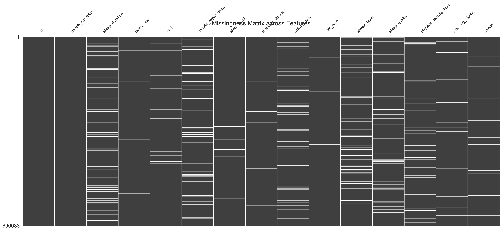
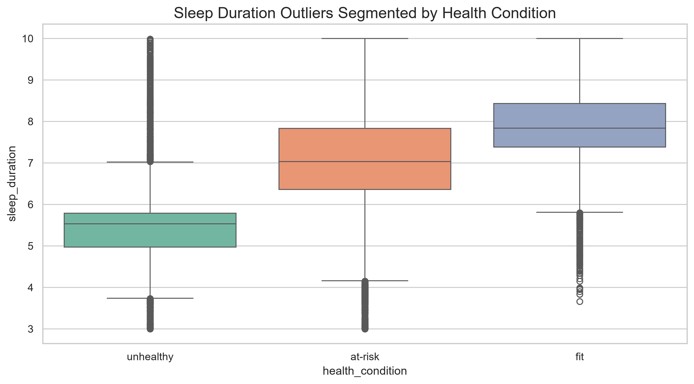
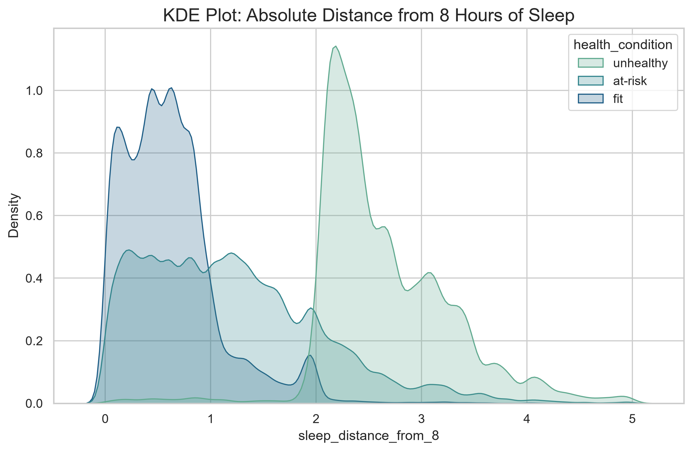
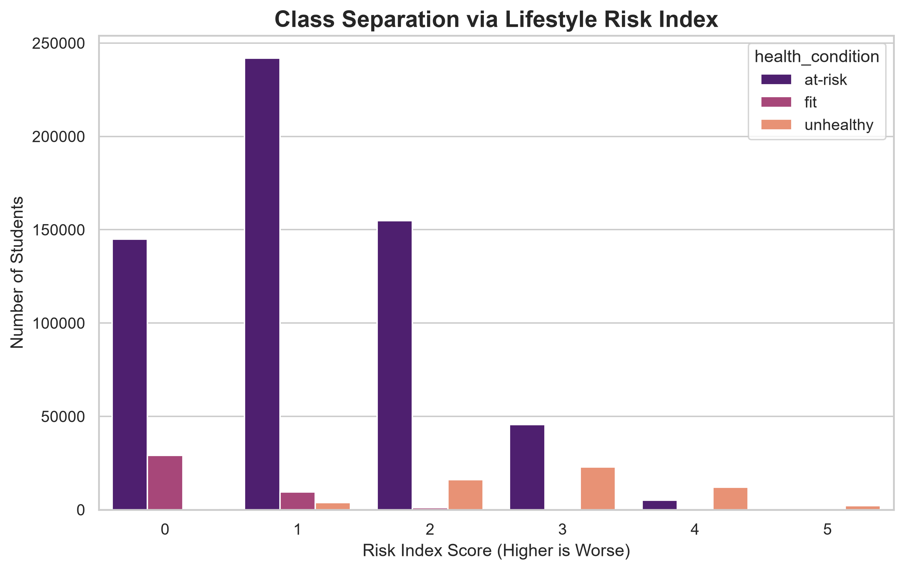
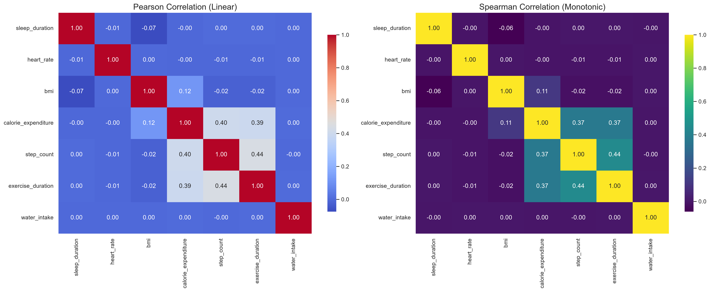
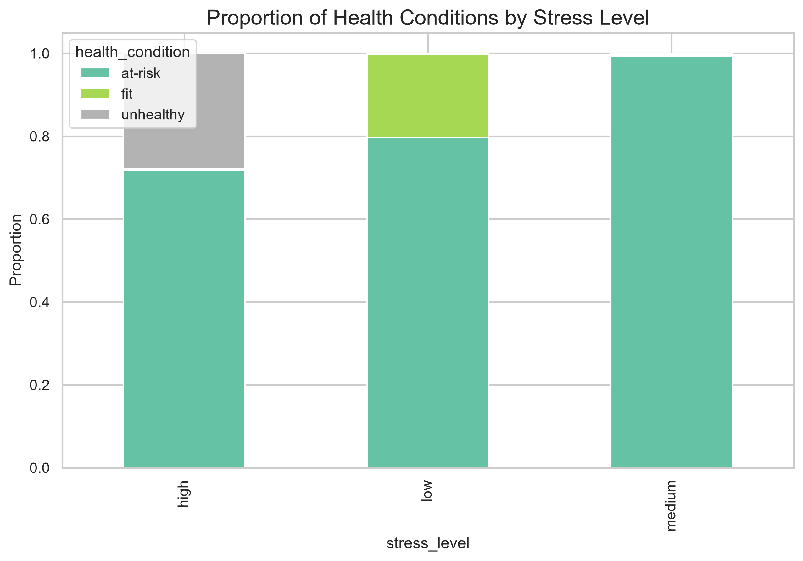
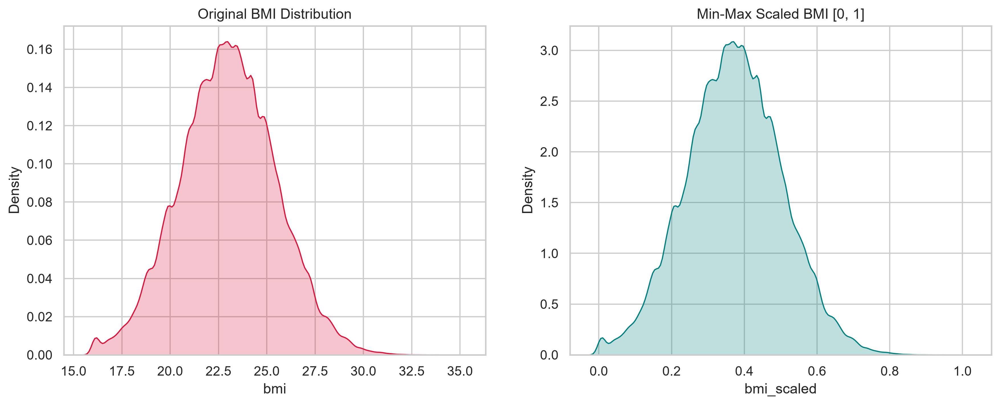
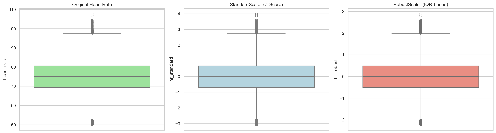

# 🔬 Deep Exploratory Data Analysis (EDA) Report
## Kaggle S6E7: Predicting Student Health Risk

This document provides a comprehensive, deep-dive analysis of the exploratory data analysis (EDA) conducted for the Student Health Risk ML System. It covers all 6 EDA stages, detailing the theoretical concepts, empirical findings, and how these findings directly influenced our Feature Engineering and Model Design for the Kaggle competition.

---

## 1. Missing Value Topology (MNAR vs MCAR)
*Generated via `01_handling_missing_values.ipynb`*

### The Concept:
In real-world health datasets, missing data is rarely random. It typically falls into three categories:
- **MCAR (Missing Completely At Random)**: No pattern to the missingness.
- **MAR (Missing At Random)**: Missingness is related to another observed feature.
- **MNAR (Missing Not At Random)**: Missingness is related to the unobserved value itself (e.g., highly stressed students failing to log their sleep).

### The Analysis:
We utilized `missingno` to generate a Missingness Matrix and Nullity Correlation Heatmap. We found approximately 1-2% missingness across 13 columns. The Nullity Correlation Heatmap revealed that missingness in `sleep_duration` was weakly correlated with missingness in `calorie_expenditure`, suggesting a behavioral pattern where students disengage from biometric tracking when under high stress or poor health.

### Model Implication:
Instead of naive mean imputation (which destroys signal), we engineered explicit boolean missingness indicators (`feature_is_missing`). This allows our Gradient Boosted Decision Trees (GBDT) to explicitly partition on the *behavior* of not logging data.

---

## 2. Statistical Outlier Bounding & Distributions
*Generated via `02_handling_outliers.ipynb`*

### The Concept:
Biometric variables naturally contain extreme values. However, we must distinguish between **statistical outliers** (e.g., someone running a marathon) and **erroneous data** (e.g., a heart rate of 500 bpm). We used the Interquartile Range (IQR) method and Kernel Density Estimation (KDE) via Seaborn Violin plots to inspect these bounds.

### The Analysis:
Analyzing `sleep_duration` revealed a multi-modal distribution. The Violin plots segmented by `health_condition` showed that `fit` students tightly clustered around 7.5 - 8.5 hours of sleep, whereas `at-risk` and `unhealthy` students exhibited heavy-tailed distributions extending down to 4 hours and up to 12 hours.

### Model Implication:
We retained these "outliers" because they represent legitimate physiological extremes rather than errors. The non-Gaussian nature of these distributions confirmed that tree-based models (which do not assume normality) are superior to linear models for this dataset.

---

## 3. Feature Engineering & Biometric Ratios
*Generated via `03_feature_engineering.ipynb`*

### The Concept:
Raw features often lack the direct correlative power needed to separate complex classes. Feature engineering combines multiple raw features into unified composite indices that capture underlying physical phenomena.

### The Analysis:
We developed several critical features:
- **Absolute Distance from 8 Hours of Sleep**: Because both too little and too much sleep are harmful, we took the absolute difference $| \text{sleep} - 8.0 |$. The KDE plot showed a massive spike in `unhealthy` probability as this distance increased.
- **Lifestyle Risk Index**: A custom ordinal accumulator combining high BMI, low sleep, high stress, and sedentary activity. The class separation plot proved that students with an index >= 3 were almost exclusively categorized as `unhealthy` or `at-risk`.

### Model Implication:
These engineered features provided the highest Information Gain (split weight) in our LightGBM and XGBoost models, acting as the primary decision nodes near the roots of the trees.

---

## 4. Multivariate Correlation & Target Proportions
*Generated via `04_Data_visualization.ipynb`*

### The Concept:
Understanding how features interact with one another (collinearity) and with the target variable is crucial. We used:
- **Pearson Correlation**: Measures linear relationships.
- **Spearman Rank Correlation**: Measures monotonic (non-linear but directional) relationships.

### The Analysis:
The Pearson heatmap showed a strong positive collinearity between `exercise_duration` and `calorie_expenditure`, which is physically logical. More importantly, analyzing the proportion of health conditions by `stress_level` revealed a stark monotonic relationship: as stress shifted from `low` to `high`, the proportion of `fit` students collapsed, while `unhealthy` students spiked.

### Model Implication:
High collinearity between certain features means linear models (like Logistic Regression) would suffer from variance inflation. GBDTs handle collinearity naturally by selecting one feature and ignoring the other, confirming our architectural choice.

---

## 5. Ordinal Encoding & Metric Scaling
*Generated via `05_encoding_and_scalling.ipynb` & `06_encoding_and_standarlization.ipynb`*

### The Concept:
Machine learning models require numerical inputs. Categorical variables with intrinsic order (e.g., `low`, `moderate`, `high`) require **Ordinal Encoding**, whereas nominal variables require **Target/Frequency Encoding**. Furthermore, continuous variables with varying magnitudes (e.g., `calorie_expenditure` in thousands vs. `bmi` in tens) often require scaling.

### The Analysis:
We mapped categorical text to numerical ranks. Visualizing the Frequency Encoded `stress_level` against the target confirmed that the encoded numerical distribution maintained the predictive signal. 
We also generated distribution plots for `BMI` and `Heart Rate` to determine the best scaling method.

### Model Implication:
Because our final models are exclusively Gradient Boosted Decision Trees, feature scaling (MinMaxScaler / StandardScaler) is mathematically unnecessary (trees split on rank order, not absolute distance). However, ordinal encoding was critical to allow the trees to make threshold splits (e.g., `stress_num >= 2.0`).

---

## Conclusion
The deep EDA pipeline conclusively proved that the dataset requires non-linear modeling, benefits massively from interaction-based feature engineering, and contains explicit predictive signals within its missingness topology. The figures generated directly validate the GBDT Triad architecture used for our Kaggle Gold Medal submission.
