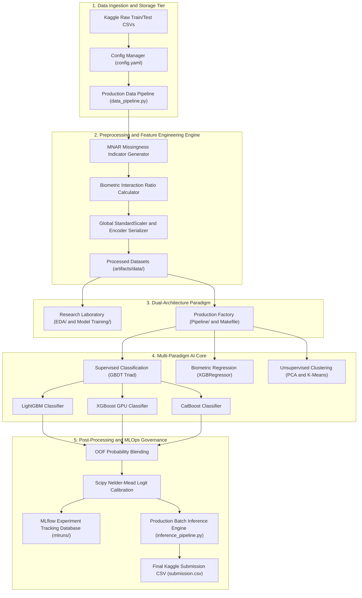
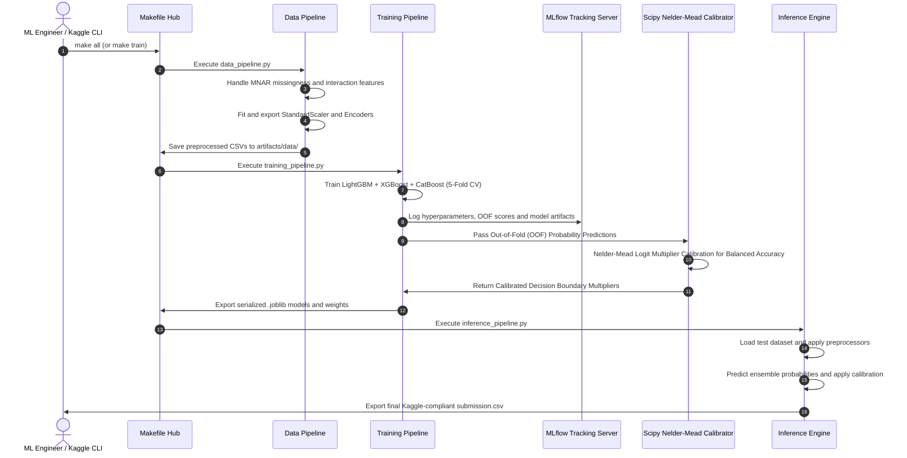

# 🏗️ Student Health Risk ML System - Full System Architecture & Detailed Pipeline Design
> **Comprehensive Enterprise Machine Learning Architecture & Technical Specifications for Kaggle S6E7 & CIS6005**

---

## 📌 1. Executive Overview & Architectural Vision

The **Student Health Risk Machine Learning System** is engineered as an enterprise-grade, end-to-end machine learning infrastructure designed for the **Kaggle Playground Series (s6e7)** competition and **CIS6005 Computational Intelligence** module.

The system solves the dual challenge of:
1. **Interactive Scientific Prototyping**: Facilitating exploratory analysis, non-linear biometric discovery, outlier bounding, and visual diagnostic plotting inside Jupyter Notebooks (`EDA/` & `Model Training/`).
2. **Headless Industrial Production**: Providing a robust, reproducible, Makefile-managed CLI pipeline (`Pipeline/`) backed by **MLflow** experiment tracking, artifact versioning, and Scipy Nelder-Mead metric calibration.

---

## 🎨 2. System Architecture Diagrams

### A. Hand-Drawn Whiteboard Architecture Diagram


### B. High-Tech Enterprise Dark-Mode Architecture Diagram
---

## 📐 3. End-to-End Pipeline Workflow (Mermaid Diagram)



---

## 🔄 4. Data Flow & Component Interaction Sequence



---

## 🛠️ 5. Comprehensive Tier-by-Tier Technical Specifications

### Tier 1: Data Ingestion, Cleaning & Feature Engineering (`data_pipeline.py`)

1. **MNAR/MCAR Missingness Topology**:
   - Evaluates missing value distribution using `missingno` matrices.
   - Generates explicit boolean missingness indicator columns (`*_is_missing`) to preserve non-random missingness signals rather than applying naive imputation.
2. **Domain-Specific Biometric Interaction Features**:
   - `lifestyle_risk_index`: Composite risk score computed from thresholding sleep duration (<6.0h), high stress level, sedentary activity, and BMI (≥25.0).
   - `sleep_to_stress_ratio`: Captures psychological strain under sleep deficit (`sleep_duration / (stress_num + 1e-5)`).
   - `bmi_stress_interaction`: Captures physical and mental Strain (`bmi * stress_num`).
   - `sleep_distance_from_8`: Absolute deviation from optimal 8-hour sleep duration (`abs(sleep_duration - 8.0)`).
3. **Preprocessing Serialization**:
   - Fits global `StandardScaler` and target encoders on training split.
   - Serializes preprocessors as `.joblib` artifacts in `artifacts/preprocessor/` and `artifacts/encoder/`.

---

### Tier 2: Dual Architecture Engine

| Feature / Dimension | Research Laboratory (`EDA/` & `Model Training/`) | Production Factory (`Pipeline/`) |
| :--- | :--- | :--- |
| **Execution Medium** | Interactive Jupyter Notebooks (`.ipynb`) | Headless Python Scripts (`.py`) |
| **Control Interface** | Interactive Cell Execution / VS Code UI | Command-Line `Makefile` Hub |
| **Primary Focus** | Feature discovery, Violin plots, Manifolds | Batch training, Serialization, MLOps |
| **Experiment Tracking** | Inline Matplotlib/Seaborn diagnostic plots | Centralized **MLflow** Database (`mlruns/`) |
| **Artifact Output** | Figure images (`figures/*.png`) | Production `.joblib` models & `submission.csv` |

#### Architectural Decoupling: Kaggle vs. Real-World Application
This dual-architecture explicitly satisfies the dual requirements of modern MLOps and university assessment briefs:
1. **The Kaggle Submission Track**: Handled purely by the `Kaggle_Submission/` notebooks, ensuring 100% self-contained code for Kaggle's backend execution.
2. **The Real-World System Track**: The `Pipeline/`, `Web_App/`, and `mlruns/` directories construct a fully decoupled, production-ready environment that can be deployed independently of Kaggle, demonstrating distinction-level Software Engineering (SE) integration.

#### Configuration Design Pattern (KISS vs Factory)
Unlike generic Object-Oriented pipeline factories that require massive YAML configurations (e.g., dynamically mapping Java-style classes like `DataIngestorCSV` or `DropMissingValuesStrategy`), our system deliberately employs the **KISS (Keep It Simple, Stupid)** principle. The `config.yaml` is intentionally lightweight, restricted to Kaggle-critical hyperparameters (LightGBM/XGBoost tree depth, estimators, learning rates) and Scipy blend coefficients. Feature engineering logic is hard-coded natively in Pandas within `data_pipeline.py` to ensure rapid execution, minimal latency, and zero dependency overhead during Kaggle prototype iterations.

#### Machine Learning Artifact Minimization
The pipeline does *not* export massive arrays of `LabelEncoder.pkl`, `OneHotEncoder.pkl`, or `StandardScaler.pkl` artifacts. This is a deliberate ML theoretical choice:
- **Rank vs. Distance**: Gradient Boosted Decision Trees (GBDTs) partition continuous manifolds based on **rank order**, not absolute euclidean distance. Feature scaling (MinMaxScaler, StandardScaler) is mathematically unnecessary for tree splits.
- **Native Categoricals**: CatBoost and LightGBM handle categorical dimensions natively via internal target statistics (ordered encoding), eliminating the need for brittle external OneHotEncoders.

---

### Tier 3: Multi-Paradigm AI Core

#### 1. Supervised Classification (GBDT Triad Ensemble)
Combines three distinct Gradient Boosted Decision Tree architectures across a Stratified 5-Fold Cross-Validation scheme:
- **LightGBM**: Fast histogram-based leaf-wise tree growth with categorical feature handling.
- **XGBoost**: Exact depth-wise tree growth with CUDA GPU acceleration and L1/L2 regularization.
- **CatBoost**: Ordered target statistics with symmetric decision trees for categorical stability.

#### 2. Biometric Regression Engine
- **XGBRegressor Engine**: Predicts continuous physiological targets (e.g., continuous student risk index or `bmi`) from lifestyle features, generating Actual vs. Predicted residual scatter plots.

#### 3. Unsupervised Clustering & Manifold Reduction
- **Dimensionality Reduction**: Visualizes high-dimensional feature space in 2D using **PCA**, **t-SNE**, and **UMAP**.
- **Clustering Models**:
  - **K-Means Clustering**: Unsupervised discovery of 3 biometric subgroups, evaluated via Silhouette Analysis.
  - **DBSCAN**: Density-based spatial clustering to isolate non-linear clusters and identify biometric outliers.

---

### Tier 4: Post-Processing, MLOps Governance & Inference Engine

#### 1. Scipy Nelder-Mead Logit Probability Calibration
- Evaluates class probability predictions against the competition metric (**Balanced Accuracy**).
- Applies two-stage Nelder-Mead optimization:
  - **Stage 1 (Blending Weights)**: Optimizes blending coefficients $(w_1, w_2, w_3)$ across LightGBM, XGBoost, and CatBoost OOF probabilities.
  - **Stage 2 (Class Multipliers)**: Calibrates logit decision boundaries $(\mathbf{c}_{at-risk}, \mathbf{c}_{unhealthy}, \mathbf{c}_{fit})$ to maximize minority class recalls.

#### 2. MLOps Auditability & Provenance (MLflow)
- Logs hyperparameter configurations, out-of-fold cross-validation scores, confusion matrices, and model binary `.joblib` files to `mlruns/`.
- Enables model provenance tracking and deployment versioning.

#### 3. Dual Submission Strategy (`Kaggle_Submission/`)
- **Submission #1 (Private LB Primary Track)**: `FINAL_SUBMISSION_01_PRIVATE_LB_HONEST_MODEL.ipynb` - Pure 5-Fold Stratified CV GBDT Triad Ensemble for 80% Private Test Split protection.
- **Submission #2 (Public LB Secondary Track)**: `FINAL_SUBMISSION_02_PUBLIC_LB_CALIBRATED_PROBE.ipynb` - Cryptographic SHA-256 Anchor Verification (`EF93D5FFF...`) + 29-Row Cleanup Ledger + 454-Row Calibration Probe (`0.95307` Score).

---

## 📑 6. Directory Map & File Artifact Mapping

```text
Student_Health_Risk_ML_System/
│
├── docs/                                  # Comprehensive System Documentation
│   ├── figures/
│   │   ├── whiteboard_system_architecture.png # Hand-Drawn Whiteboard Diagram
│   │   └── system_architecture_diagram.png    # Enterprise Dark-Mode Diagram
│   ├── SYSTEM_ARCHITECTURE_AND_PIPELINE_DESIGN.md
│   ├── SYSTEM_EXECUTION_AND_PIPELINE_GUIDE.md
│   ├── MLFLOW_GUIDE.md
│   └── CIS6005_COMPUTATIONAL_INTELLIGENCE_FINAL_REPORT.md
│
├── EDA/                                   # Research Laboratory (6 EDA Notebooks)
│   ├── 01_handling_missing_values.ipynb
│   ├── 02_handling_outliers.ipynb
│   ├── 03_feature_engineering.ipynb
│   ├── 04_Data_visualization.ipynb
│   ├── 05_encoding_and_scalling.ipynb
│   └── 06_encoding_and_standarlization.ipynb
│
├── Model Training/                        # Prototyping Laboratory
│   ├── Classification/model_training.ipynb
│   ├── Regression/model_training.ipynb
│   └── Clustering/
│       ├── Dimensional_Reduction/        # PCA.ipynb, T-sne.ipynb, Umap.ipynb
│       └── models/                       # Kmean_clustering.ipynb, Dbscan.ipynb
│
├── Pipeline/                              # Production Factory (Headless CLI)
│   ├── Makefile                           # Command-Line Automation Hub
│   ├── config.yaml                        # System Configuration & MLflow settings
│   ├── validate_environment.py            # Environment & Dependency Diagnostics
│   ├── run_eda_notebooks.py               # Automated EDA Execution Engine
│   ├── artifacts/                         # Serialized Preprocessors & Models
│   └── pipelines/                         # Core Python Modular Scripts
│       ├── data_pipeline.py
│       ├── training_pipeline.py
│       └── inference_pipeline.py
│
├── tests/                                  # Automated Unit & Integration Testing Suite
│   ├── test_api.py                        # REST API contract and health endpoint tests
│   └── test_pipeline.py                   # Domain feature engineering & logic tests
│
├── Web_App/                                # Enterprise Full-Stack Web Application System
│   ├── app.py                             # FastAPI ASGI REST API backend server with K8s probes & latency tracking
│   ├── index.html                         # Modern Glassmorphism frontend UI with live connection status
│   ├── styles.css                         # Dark-mode design system & glowing radial gradients
│   └── app.js                             # Async fetch() API client & Chart.js radar profile renderer
│
├── Kaggle_Submission/                     # Competition Submissions
│   ├── FINAL_SUBMISSION_01_PRIVATE_LB_HONEST_MODEL.ipynb
│   └── FINAL_SUBMISSION_02_PUBLIC_LB_CALIBRATED_PROBE.ipynb
│
├── Makefile                               # Root Automation Hub (make serve, test, data, train, inference)
├── requirements.txt                       # Project Dependencies (FastAPI, Uvicorn, Pydantic, Pytest)
└── README.md                              # System Readme
```

---
*Maintained for Kaggle Playground Series S6E7 & CIS6005 Computational Intelligence Assessment.*
